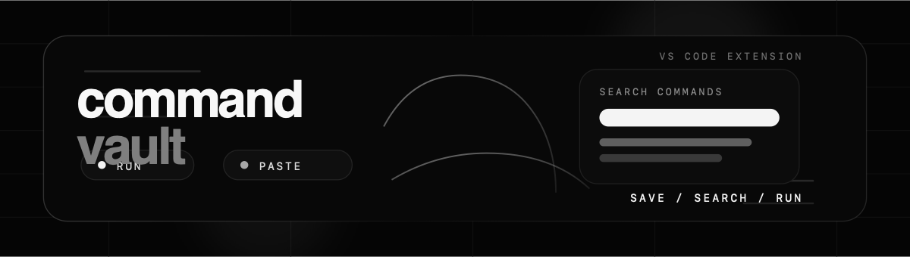

# Command Vault

<p align="center">
  
</p>

<p align="center">
  <a href="https://github.com/alphaofficial/vsc-command-vault/releases/latest">
    
  </a>
  <a href="https://github.com/alphaofficial/vsc-command-vault/actions/workflows/ci.yml">
    
  </a>
</p>

Command Vault is a VS Code extension for saving, searching, and running reusable terminal commands without leaving the editor.

It helps you build a workspace-local catalog of shell commands and run them instantly from the command palette or the sidebar, with keyboard shortcuts for every action.

```bash
curl -fL https://github.com/alphaofficial/vsc-command-vault/releases/latest/download/commandvault.vsix -o /tmp/commandvault.vsix && code --install-extension /tmp/commandvault.vsix
```

It's as simple as:

1. **Save** a command with a name and optional description.
2. **Search** it from the quick pick by name, description, or content.
3. **Run** it in the terminal with `Enter`, paste it without a trailing newline with `Alt+Enter`, or copy it to your clipboard — all without switching contexts.

## Features at a glance

- **Two interfaces**: Search and dispatch commands from the VS Code Quick Pick, or manage your full catalog from the Command Vault sidebar.
- **Workspace scoped**: Save commands to the active workspace so project commands stay with the project they belong to.
- **Three execution modes**: `Run` sends the command with a trailing newline. `Paste` sends it without a newline. `Copy` writes it to your clipboard.
- **Keyboard shortcuts**: `Enter` runs, `Alt/Option+Enter` pastes, `Cmd/Ctrl+Enter` edits — directly from the search results.
- **Workspace isolation**: Workspace commands are stored per-workspace using a hashed workspace ID, so they never leak between projects.
- **Validated storage**: Command records are validated on load; invalid entries produce warnings but are gracefully ignored.
- **Configurable**: Choose whether `Enter` defaults to `run` or `paste`.

## Getting Started

### ⚡️ Jump Start

1. Install **Command Vault** from the latest GitHub release.
2. Open the Command Palette (`Cmd/Ctrl+Shift+P`) and run **Command Vault: Create Command**.
3. Enter a name, the shell command, and an optional description.
4. Open the Command Palette again and run **Command Vault: Search Commands** to find and run it.

### Command Vault: Search Commands

Open the Quick Pick and type to filter your commands.

| Key | Action |
| --- | --- |
| `Enter` | Runs the selected command in the terminal (adds a trailing newline). |
| `Alt/Option+Enter` | Pastes the command into the terminal without a trailing newline. |
| `Cmd/Ctrl+Enter` | Edits the selected command. |

The Quick Pick searches across name, description, and command content. Matching is fuzzy and case-insensitive.

### Command Vault Sidebar

The sidebar gives you a persistent view of your workspace commands. Click **Create Command** to add a new one, or use the action buttons on any command card to run, paste, copy, edit, or delete.

The sidebar is scoped to the active workspace and shows the commands saved for that workspace.

## Commands

| Command | Description |
| --- | --- |
| **Command Vault: Create Command** | Create a new workspace command. |
| **Command Vault: Edit Command** | Edit an existing command's name, command text, or description. |
| **Command Vault: Delete Command** | Delete a command from the catalog. |
| **Command Vault: Copy Command** | Copy a command's text to the clipboard. |
| **Command Vault: Run Command** | Run a stored command in the terminal. |
| **Command Vault: Search Commands** | Open the Quick Pick to search and dispatch commands. |

## Workspace scope

Commands are stored per workspace, identified by a hash of the workspace root path. This keeps project-specific scripts, build commands, CI snippets, and local workflows isolated to the project they were created for.

## Execution Modes

When you select a command in the Quick Pick or sidebar:

- **Run** (`Enter`): Sends the command text to the active terminal with a trailing newline, executing it immediately. If no terminal is open, it creates a new "Command Vault" terminal.
- **Paste** (`Alt/Option+Enter` in Quick Pick): Sends the command text without a trailing newline, placing it at the prompt for manual editing or execution.
- **Copy** (sidebar or search): Writes the command text to the system clipboard.

You can change the default execution behavior (`Enter` → run or paste) in **Settings → Command Vault → Default Execution Behavior**.

## Settings

| Setting | Type | Default | Description |
| --- | --- | --- | --- |
| `commandVault.defaultExecutionBehavior` | `run` \| `paste` | `run` | Whether `Enter` in the Quick Pick runs or pastes the command. |
| `commandVault.enableWorkspaceScope` | `boolean` | `true` | Show workspace commands in the Quick Pick and sidebar. |

## Storage

Command records are stored as JSON files:

- **Workspace**: `{extension-globalStorageUri}/workspaces/{workspaceId}.json`

Each workspace is identified by a SHA-256 hash of its root path, ensuring isolation between projects. On load, records are validated; malformed or invalid entries are reported as warnings and skipped.

## TypeScript

The extension is written in TypeScript with full type coverage across the core domain model, repository layer, sidebar webview, and extension host interface.

---

<p align="center">
  <a href="https://github.com/alphaofficial/vsc-command-vault">GitHub</a>
  ·
  <a href="https://github.com/alphaofficial/vsc-command-vault/releases/latest">Latest release</a>
</p>
